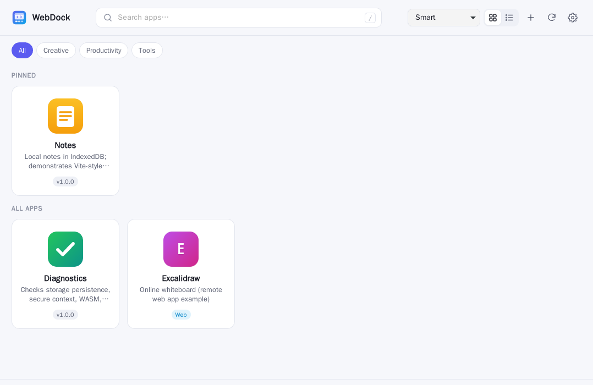

# WebDock

像原生桌面应用一样运行本地 Web 应用。把含有 `index.html` 的文件夹放进应用目录，启动 WebDock：只有一个应用时直接打开，有多个应用时先显示启动器。

基于 Rust 和 Tauri 2，支持 Windows、macOS 和 Linux。

[English](../README.md)



## 安装

在最近一次成功的 [CI 运行](../../../actions/workflows/ci.yml)页面底部的 Artifacts 中下载对应平台的安装包并安装。

**macOS：** 没有 Developer ID 证书时安装包使用 ad-hoc 签名，第一次打开会提示“Apple 无法验证……”。先打开一次，然后在 **系统设置 → 隐私与安全性** 中点击 **仍要打开**，或者执行：

```bash
xattr -dr com.apple.quarantine /Applications/WebDock.app
```

## 添加应用

应用目录下的每个子文件夹就是一个应用：

```
apps/
├── notes/          # 任意静态站点或构建产物（Vite、webpack……）
│   ├── index.html
│   └── assets/
└── whiteboard/
    └── webdock.toml  # 写 url = "https://excalidraw.com/" 即可把网站包装成应用
```

也可以把文件夹拖到启动器窗口，或点击 **+** 导入。目录变化时启动器会自动刷新。以 `.` 或 `_` 开头的文件夹会被忽略。

每个应用有独立的窗口和独立的存储（localStorage、IndexedDB、Cookie）。在启动器中右键应用可以固定、在新窗口打开、打开数据目录、清除数据或创建桌面快捷方式（Windows 和 Linux）。

## 配置

WebDock 按以下顺序查找 `webdock.toml`：

1. `--config <文件>`
2. 环境变量 `WEBDOCK_CONFIG`
3. 可执行文件所在目录（便携模式）
4. 用户配置目录，例如 Linux 的 `~/.config/com.nilzx.webdock/`、Windows 的 `%APPDATA%\com.nilzx.webdock\`、macOS 的 `~/Library/Application Support/com.nilzx.webdock/`

都找不到时会在那里生成一份带完整注释的默认配置。相对路径以配置文件所在目录为准。常用设置：

```toml
apps_dir = "apps"          # 应用目录
data_dir = ""              # 应用数据目录；留空 = 系统应用数据目录

[launcher]
language = "en"            # "en"、"zh" 或 "auto"
auto_open_single = true    # 只有一个应用时直接打开
tray = true                # 托盘图标，可快速打开所有应用

[webview]
devtools = false           # 允许打开 WebView 开发者工具
external_links = "browser" # "browser"、"allow" 或 "block"
```

大部分设置也可以在启动器的设置（齿轮图标）中修改。

**便携模式：** 把 `webdock.toml`（`apps_dir = "apps"`、`data_dir = "data"`）放在可执行文件旁边，所有内容都在同一个文件夹里。

## 单个应用的设置

应用文件夹中可以放一个 `webdock.toml` 覆盖默认值，所有字段都是可选的：

```toml
name = "我的笔记"           # 默认：Web manifest 名称 → <title> → 文件夹名
description = "…"
category = "效率"           # 用于启动器分类筛选
icon = "icon.png"          # 默认：manifest 图标、<link rel=icon>、icon.png、favicon.*
entry = "dist/index.html"  # 默认：index.html
url = "https://…"          # 打开网站而不是本地文件

[window]
width = 1280
height = 820

[webview]
mode = "localhost"                     # 通过 http://127.0.0.1 提供（Service Worker 需要）
permissions = ["camera", "microphone"] # 免询问授权
allow_navigation = ["youtube.com"]     # 允许在应用内加载的外部域名（iframe、登录跳转）
cross_origin_isolated = true           # 启用 SharedArrayBuffer
```

## 命令行

```
webdock [--config <文件>] [--apps-dir <目录>] [--app <id>] [--launcher]
```

`--app <id>` 直接打开某个应用（桌面快捷方式就是用它）。WebDock 已在运行时再次启动，会把参数转交给正在运行的实例。

## 快捷键

| 位置 | 按键 | 作用 |
| --- | --- | --- |
| 启动器 | `/` 或 `Ctrl+K` | 搜索 |
| 启动器 | 方向键、`Enter`、`Ctrl+Enter` | 移动、打开、在新窗口打开 |
| 启动器 | `F5` | 重新扫描应用 |
| 应用 | `F5` / `Ctrl+R`、`F11`、`Ctrl` `+`/`-`/`0` | 刷新、全屏、缩放 |

## 平台说明

- Linux 上本地应用无法使用 Cookie，需要 Cookie 的应用请设置 `mode = "localhost"`。
- macOS 上按应用独立存储需要 macOS 14 及以上，更早的版本仍按 origin 隔离。
- `examples/apps/diagnostics` 可以查看当前机器上各项 Web 能力是否可用。

## 从源码构建

需要 Rust 1.98、Node.js 18+ 以及对应平台的 [Tauri 前置依赖](https://v2.tauri.app/start/prerequisites/)。

```bash
npm install
npm run dev     # 开发运行
npm run build   # 安装包在 src-tauri/target/release/bundle

# 用自带的示例应用试用
cd src-tauri && cargo run -- --config ../examples/webdock.toml
```

在 macOS 上构建同时支持 Apple 芯片和 Intel 的版本：

```bash
rustup target add aarch64-apple-darwin x86_64-apple-darwin
npm run build -- --target universal-apple-darwin
```

要在 CI 中签名并公证 macOS 版本，请在仓库 secrets 中添加：`APPLE_CERTIFICATE`（`.p12` 的 base64）、`APPLE_CERTIFICATE_PASSWORD`、`APPLE_SIGNING_IDENTITY`，公证还需要 `APPLE_ID`、`APPLE_PASSWORD`、`APPLE_TEAM_ID`。

## 许可证

MIT
